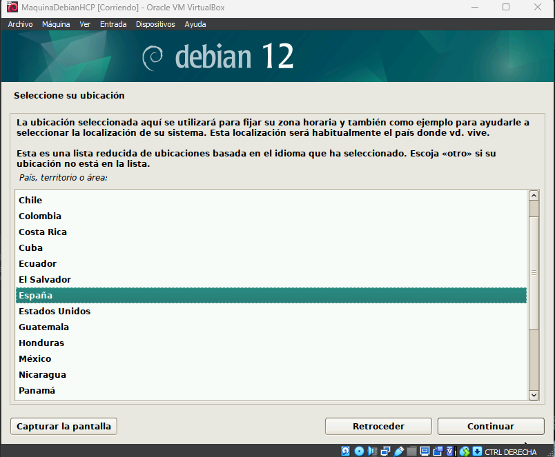
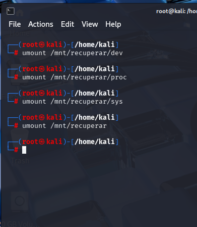

# Tarea 2.3: Montado de un sistema de ficheros con `chroot`

---

## Pasos de la tarea

---

### 1. Instalación desde cero de una máquina Debian

- Crear una nueva máquina virtual en VirtualBox.
- Instalar Debian desde la imagen `.iso`.
- Configurar los siguientes parámetros:
  - Idioma: Español
  - Teclado: Español
  - Zona horaria: tu región
  - Particionado guiado: todo en una sola partición
- Crear un usuario con tu nombre personal:
  - Nombre completo: Hugo
  - Nombre de usuario: hugo
  - Contraseña: (la que elijas) en este caso utilizaremos "abc123."





---

### 2. Configurar VirtualBox con la ISO de Kali Linux

- Apagar la VM si está encendida.
- Ir a `Configuración > Almacenamiento`.
- Añadir la imagen `.iso` de Kali Linux como unidad óptica.
- En `Configuración > Sistema > Orden de arranque`, colocar la unidad óptica antes que el disco duro.


---

### 3. Arrancar la máquina virtual desde Kali Linux Live

- Iniciar la máquina virtual.
- Kali Linux debería cargar como sistema Live.
- Abrir una terminal para realizar los pasos siguientes.


---

### 4. Comandos a ejecutar desde la terminal de Kali Linux

#### 4.1 Cambiar a castellano el teclado

```bash
loadkeys es
```


---

#### 4.2 Acceder a la consola de root

```bash
sudo su
```


---

#### 4.3 Mostrar el sistema de ficheros montado

```bash
mount
```


---

#### 4.4 Listar la tabla de particiones del disco `/dev/sda`

```bash
fdisk -l /dev/sda
```


---

#### 4.5 Crear el directorio `/mnt/recuperar`

```bash
mkdir /mnt/recuperar
```


---

#### 4.6 Montar la partición 1 del disco duro en `/mnt/recuperar`

```bash
mount -t auto /dev/sda1 /mnt/recuperar
lsblk -f
```


---

#### 4.7 Montar `/dev` `/proc` `/sys` dentro de la ruta montada

```bash
mount --bind /dev /mnt/recuperar/dev
```
```bash
mount --bind /proc /mnt/recuperar/proc
```
```bash
mount --bind /sys /mnt/recuperar/sys
```


---

#### 4.8 Crear una jaula con `chroot`

```bash
chroot /mnt/recuperar
```
Una vez dentro de la jaula:
- Estás trabajando directamente sobre el sistema Debian instalado.
- Puedes realizar tareas administrativas como cambiar contraseñas.
- Puedes realizar tareas varias como la creacion y edicion de archivos

Ejemplo: Creacion de archivo de texto en el directorio personal:

```bash
echo Hugo estuvo aqui > /home/hugo/prueba.txt
```


#### 4.9 Desmontar los directorios utilizados

Salir de la jaula:

```bash
exit
```
Desmontar todo:

```bash
umount /mnt/recuperar/dev
umount /mnt/recuperar/proc
umount /mnt/recuperar/sys
umount /mnt/recuperar
```


---

### 5. Apagar y reiniciar el sistema Debian

- Apagar la máquina virtual:

```bash
poweroff
```


- Quitar la ISO de Kali Linux desde la configuración de almacenamiento de VirtualBox.
- Reiniciar la VM.
- Iniciar sesión en Debian como usuario `hugo`.
- Verificar que existen las pruebas realizadas desde `chroot`:

```bash
ls /home/hugo
cat /home/hugo/prueba.txt
```


---

##  Conclusión

La práctica demuestra cómo se puede montar y recuperar un sistema Linux utilizando una distribución Live y el comando `chroot`, accediendo directamente al sistema de archivos montado desde otro entorno.
