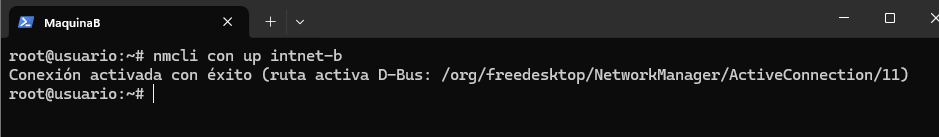

#  Configuración de Red Interna en VirtualBox con Netplan y NetworkManager

## Objetivo

Configurar una red interna entre dos máquinas virtuales en VirtualBox utilizando direcciones IP estáticas, haciendo que la configuración sea persistente mediante `netplan` (máquina A) y `NetworkManager` (máquina B).

---

##  Paso 1: Clonar dos máquinas virtuales

- Usamos una máquina base con Ubuntu.
- Clonamos dos veces usando la opción de **clonado enlazado** y activamos la casilla **reinicializar direcciones MAC**.
- Nombramos las máquinas como `maquinaA` y `maquinaB`.


---

## Paso 2: Configurar adaptadores de red

- En VirtualBox → Configuración de cada máquina:
  - Activamos el **Adaptador 2**.
  - Modo: **Red Interna**
  - Nombre: `intnet_FH`


---

## Paso 3: Asignar IPs estáticas (no persistentes)

### En máquina A:


```bash
sudo ip addr add 192.168.100.2/24 dev enp0s8
sudo ip link set enp0s8 up
```


### En máquina B:

</br>

```bash
sudo ip addr add 192.168.100.3/24 dev enp0s8
sudo ip link set enp0s8 up
```


---

##  Paso 4: Verificar conectividad con `ping`

Desde `maquinaA`:
```bash
ping 192.168.100.3
```


Desde `maquinaB`:
```bash
ping 192.168.100.2
```


---

##  Paso 5: Configuración persistente

###  Máquina A: Usando **Netplan**

1. Editamos el archivo:
```bash
sudo nano /etc/netplan/01-netcfg.yaml
```

2. Contenido del archivo:
```yaml
network:
  version: 2
  ethernets:
    enp0s8:
      addresses:
        - 192.168.100.2/24
      dhcp4: no
```

3. Ajustar permisos:
```bash
sudo chmod 600 /etc/netplan/01-netcfg.yaml
```

4. Aplicar configuración:
```bash
sudo netplan apply
```


---

###  Máquina B: Usando **NetworkManager (nmcli)**

1. Crear conexión:
```bash
nmcli con add type ethernet ifname enp0s8 con-name intnet-b ip4 192.168.100.3/24
```

2. Activar conexión:
```bash
nmcli con up intnet-b
```

3. Verificar:
```bash
ip addr show enp0s8
```

---

##  Verificación final

- Ambas máquinas tienen IP estática correctamente configurada.
- Se pueden hacer ping entre sí incluso después de reiniciar.


---

## Conclusion

- Se conecta dos máquinas en red interna sin DHCP.
- Se usa `netplan` y `nmcli` para configuración persistente de red.
