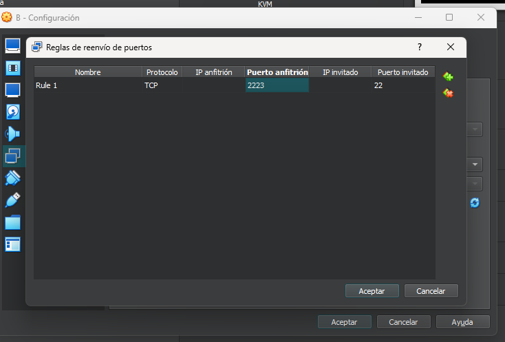
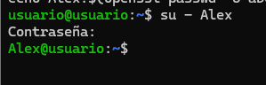
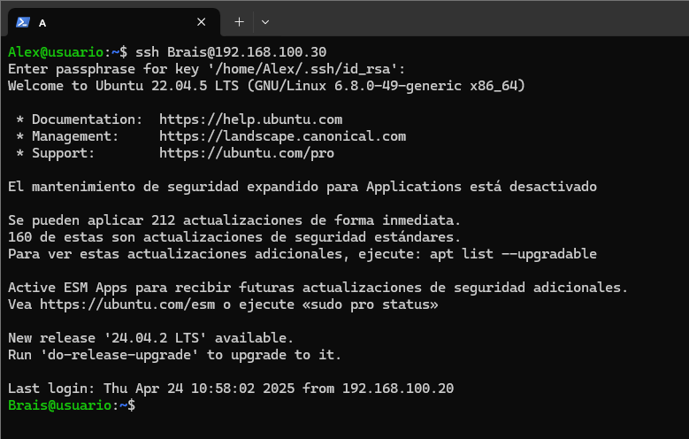

# Tarea SSH y SCP
## Primero configuraremos las máquinas 
Las pondremos en una misma red interna que permita que se conecten para poder realizar la practica
   
Además cambiaremos el puerto destinado al ssh de la máquina B manteniendo el de A en el 2222
 
## Configuracion de Red
Configuramos las ip de las máquinas en este caso 192.168.100.20 para la maquina A  
  
Repetimos el proceso con la máquina B y la IP 192.168.100.30 
  
Comprobamos que las maquinas pueden comunicarse facendo ping  
 
## Creacion de Usuarios
Creamos el usuario Alex para la máquina A y Brais para la B
  
Nos conectamos a estes usuarios en cada una de las máquinas 
  
## Conexion máquina A hacia B
Conectamos la máquina A mediante ssh a la máquina B con el usuario Brais recien creado 
 
## Creamos un archivo de texto
Mediante comandos crearemos un archivo de texto en el directorio temporal y lo transmitiremos hacia el servidor (máquina B) 
 
Repetimos el proceso en la máquina B  
  
Y ahora lo llevamos hacia A  
 
## Descraga en el anfitrion
Descargaremos los archivos generados anteriormente en el ordenador anfitrion concretamente en el escritorio en mi caso en ASIR107 que es mi usuario 
 
Y comprobamos 
 
### 2ª Descarga en el anfitrion
Ahora en esta ocasion haremos uso de un bucle para la creacion de 200 archivos de texto que ma starde volcaremos sobrer el anfitrion 
 
Ahora descargamos en el anfitrion, que en mi caso cree una carpeta para que el escritorio no se llenase de elementos 
 
Y comprobamos 
 
## Clave de conexion 
Ahora crearemos una clave para evitar  utilizar constantemente la contraseña al conectarnos al servidor ssh en nuestro caso utilizaremos una clave sencilla para facilitar este proceso 
  
Una vez hecha la compartiremos con el servidor 
 
Y comprobamos si podemos hacer la conexion mediante el uso de la clave 
 
En este caso la crecaion de la clave la hacemos al final pero hacerla al principio tampoco supondria ningun tipo de inconveniente, con esto dasmos por finalizada la practica.
